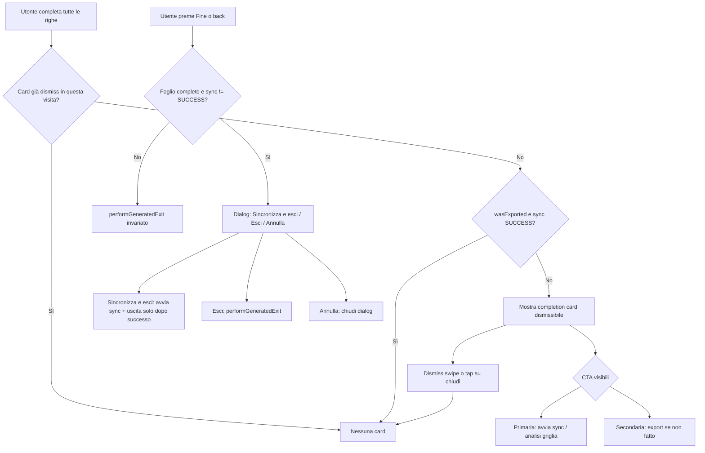

# TASK-053 — GeneratedScreen: completion card (dismiss + export/sync) e dialog Fine su sync pendente

---

## Informazioni generali

| Campo                | Valore                                      |
|----------------------|---------------------------------------------|
| ID                   | TASK-053                                    |
| Stato                | **DONE**                                    |
| Priorità             | **ALTA**                                    |
| Area                 | UX/UI — GeneratedScreen                    |
| Creato               | 2026-04-13                                  |
| Ultimo aggiornamento | 2026-04-14 (review planner APPROVED + fix polish; DONE)       |

---

## Dipendenze

- **TASK-041** `DONE` — banner completamento + quick export (questo task **evolve** visibilità/copy/CTA del prompt di completamento).
- **TASK-047** `DONE` — progress card / gerarchia iOS-like.
- **TASK-052** `DONE` — uscita `performGeneratedExit` + flush `saveCurrentStateToHistory`; il nuovo dialog **non** deve contraddire la filosofia di uscita silenziosa salvo eccezioni documentate.

---

## Scopo

Migliorare il flusso UX/UI quando il foglio in `GeneratedScreen` è **completamente completato** (tutte le righe dati `complete`): sostituire/raffinare il banner attuale (TASK-041) con una **card in alto non bloccante**, **dismissibile a swipe**, con CTA coerenti per **sync database** ed **export file**, regole di visibilità per `wasExported` e `syncStatus`, e un **dialog leggero su “Fine”** se il completamento è vero ma la sync “di successo” non è ancora avvenuta — **senza** mutare la logica di business di export, analisi import, aggiornamento history, né DAO/repository/navigation.

---

## Contesto (repo-grounded)

### Flusso attuale analizzato nel codice Android

1. **`GeneratedScreen.kt`**
   - **Completamento foglio:** `showAllCompleteBanner` = `generated && dataSize > 1 && !bozzaVuotaManuale &&` tutte le righe `1..<dataSize` con `completeStates[row] == true` (stessa semantica di TASK-041).
   - **Stato history entry:** `val (syncStatus, wasExported, _) = excelViewModel.currentEntryStatus.value` (aggiornato da `ExcelViewModel.populateStateFromEntry` e dopo export/sync).
   - **Banner attuale (TASK-041):** `AnimatedVisibility` + `GeneratedScreenAllCompleteBanner` — **solo CTA export** (`requestExcelExport` = `saveLauncher.launch` con guard `!isExporting`). Titolo/sottotitolo dipendono da `wasExported` (`all_complete_banner_*`).
   - **Sync (analisi + apply):** overflow top bar → `onAnalyzeSync` = `analyzeCurrentGrid()` → `databaseViewModel.analyzeGridData(...)` → preview in `DatabaseViewModel` → `importAnalysisResult` → `NavGraph` naviga a `ImportAnalysisScreen`; dopo apply, `NavGraph` chiama `excelViewModel.markCurrentEntryAsSyncedSuccessfully` / `markCurrentEntryAsSyncedWithErrors` in base a errori analisi.
   - **Export:** `exportToUri` + `markCurrentEntryAsExported(entryUid)`; share analogo.
   - **Uscita “Fine” / back:** `performGeneratedExit` — bozza manuale vuota → `GeneratedScreenDiscardDraftDialog`; altrimenti coroutine con `saveCurrentStateToHistory` poi navigazione contestuale (TASK-052). **Oggi nessun dialog** per “sync pendente”.

2. **`ExcelViewModel.kt`**
   - `currentEntryStatus: Triple<SyncStatus, Boolean wasExported, Long uid>`.
   - `SyncStatus`: `NOT_ATTEMPTED`, `ATTEMPTED_WITH_ERRORS`, `SYNCED_SUCCESSFULLY` (`SyncStatus.kt`).
   - Export: `markCurrentEntryAsExported` aggiorna Room + stato locale.
   - Sync persistita: `updateSyncStatus` su successo / errori (da `NavGraph` dopo flusso import apply).

3. **`NavGraph.kt`**
   - Aggiornamento `syncStatus` post-apply in `LaunchedEffect` su `ImportAnalysis` + `ImportFlowState.Success`; chiusura con errori → `ATTEMPTED_WITH_ERRORS`.

4. **Stringhe oggi rilevanti:** `all_complete_banner_*`, `export_now`, `sync_with_database` (menu), ecc. in `values/`, `values-en/`, `values-es/`, `values-zh/`.

### Riferimento iOS

Repo iOS **non** presente in questo workspace; nessun confronto implementativo richiesto. Eventuale ispirazione solo a livello di pattern (card secondaria + dismiss) se in futuro si allinea visivamente, **senza** porting 1:1.

---

## Criticità UX attuali

| Criticità | Evidenza |
|-----------|----------|
| Prompt di completamento **export-centric** | Banner CTA solo “Esporta”; sync è nel menu overflow — dopo completamento righe l’azione più importante per l’inventario (allineamento DB) è **secondaria**. |
| Nessun **dismiss** | Il banner resta finché le condizioni booleane valgono; l’utente non può “archiviare” il messaggio come promemoria non obbligatorio. |
| Uscita **Fine** senza guard su sync | TASK-052 ha reso l’uscita silenziosa; è coerente con persistenza continua, ma l’utente può uscire senza aver mai lanciato la sync — **rischio operativo** per chi assume che “completato” implichi DB aggiornato. |
| Coerenza con stati `wasExported` / `syncStatus` | TASK-041 mostrava il banner anche con export già fatto (copy neutro). Il nuovo requisito chiede di **nascondere** la card quando **entrambi** export e sync “di successo” sono fatti — allineamento più stretto al modello mentale “lavoro chiuso”. |

### Gap da chiudere nel planning prima dell’EXECUTION

- **Gerarchia visiva della card non ancora esplicitata:** il plan definisce bene logica e stati, ma non ancora abbastanza la resa visiva per mantenerla coerente con il linguaggio già migliorato in TASK-047/TASK-052.
- **Feedback utente durante “Sincronizza e esci” da esplicitare meglio:** va chiarito che non si introduce un nuovo loader custom gratuito se la UI già usa feedback/snackbar/dialog esistenti; l’obiettivo è non duplicare segnali visivi.
- **Entry-point unico per la sync:** il piano parla di riuso di `analyzeCurrentGrid()`, ma conviene dichiararlo come vincolo esplicito per evitare biforcazioni future tra top bar, card e dialog.
- **Posizionamento della card:** conviene fissare nel plan che la card resti nel body superiore della `GeneratedScreen`, sotto top bar/info chips, senza spostare o competere con FAB e griglia.

### Ulteriori punti da chiarire nel plan

- **Semantica di “export fatto” da mantenere esplicita:** il plan parla di `wasExported`, ma conviene fissare che vale il comportamento già esistente della schermata, quindi export file e share continuano a contare come stato esportato se oggi aggiornano la stessa flag.
- **Copy diverso per sync non tentata vs sync con errori:** a livello UX conviene prevedere che la card possa usare tono leggermente diverso quando `syncStatus == ATTEMPTED_WITH_ERRORS`, così il prompt è più informativo senza diventare punitivo.
- **Nessun doppio trigger sulle CTA:** il planning deve richiamare esplicitamente guard anti-multi-tap su export/sync/“sincronizza e esci”, almeno a livello di stato UI locale, per evitare invii ripetuti o sequenze duplicate.
- **Dialog di uscita da sopprimere mentre è già in corso un’uscita post-sync:** se `pendingExitAfterSuccessfulSync` è attivo, il piano deve evitare che back/Fine ripropongano un secondo dialog inutile.
- **Persistenza del dismiss rispetto a cambio entry:** conviene fissare che il dismiss è legato alla singola visita della schermata e non deve “migrare” in modo ambiguo tra entry diverse se la schermata viene ricomposta con altro `entryUid`.
- **Comportamento durante export in corso:** il plan cita loading modale, ma conviene ribadire che mentre `isExporting == true` la CTA export deve risultare non riattivabile e la card non deve suggerire un’azione già in corso.
- **Priorità dei dialog già esistenti:** il piano dovrebbe esplicitare l’ordine di priorità tra bozza manuale vuota, dialog sync-pendente e altre eventuali guardie di uscita, così in execution non si introducono sovrapposizioni.
- **Riduzione del refactor gratuito:** vale la pena dichiarare che, salvo necessità reale, la completion card può restare nello stesso file/scope della schermata se questo evita dispersione di logica UI locale.
- **Nessun resurfacing inutile durante auto-exit post-sync:** se `pendingExitAfterSuccessfulSync` è attivo e la sync va a buon fine, la card non deve riapparire o “lampeggiare” prima della navigazione finale.

---

## Obiettivo UX/UI del task

1. **Completion card** in cima al body di `GeneratedScreen` (sotto padding top bar), **non modale**, con titolo tipo “Tutto completato”, testo che comunica **export e/o sync** disponibili.
2. **Dismiss swipe + dismiss esplicito** (pattern Material3 idiomatico, es. `SwipeToDismissBox` + stati `rememberSaveable`), con affordance chiara del gesto e **fallback accessibile** tramite piccola azione di chiusura esplicita (`X`/`Chiudi`) così il messaggio non dipende solo dal gesto.
3. **Sessione schermata:** dopo dismiss, la card **non ricompare** nella stessa visita a `GeneratedScreen`; in più deve **ricomparire solo** quando c’è una nuova transizione significativa verso lo stato “tutto completato” oppure quando si entra in una nuova visita della schermata con stato ancora utile.
4. **CTA:** rispettare la matrice di visibilità (sezione sotto); **primaria = sync**, **secondaria = export** quando entrambe sono utili; se rimane una sola azione, quella azione diventa primaria.
5. **Dialog su Fine/back:** se foglio completo e sync “non ancora riuscita”, chiedere conferma focalizzata sul DB; se sync già **SYNCED_SUCCESSFULLY**, uscita come oggi; se foglio **non** completo, **nessun** nuovo dialog (nessuna regressione su `performGeneratedExit`).
6. **Coerenza visiva:** la completion card deve sembrare un’evoluzione del linguaggio già introdotto in `GeneratedScreen` (spaziatura ariosa, card curata, gerarchia chiara, CTA ordinate), evitando look da warning aggressivo o banner “grezzo”.
7. **Singolo entry-point funzionale per la sync:** card, top bar e dialog di uscita devono riusare lo stesso trigger logico della sync già esistente, senza introdurre flussi paralleli o differenze comportamentali non necessarie.
8. **Feedback più preciso sullo stato sync:** quando utile, la card può adattare il copy in modo leggero tra “sync non ancora eseguita” e “sync da ritentare dopo errori”, mantenendo tono positivo e non allarmistico.
9. **Protezione da azioni ripetute:** CTA card e dialog non devono permettere facilmente doppi tap o trigger multipli della stessa azione durante uno stato già in corso.
10. **Gerarchia delle guardie di uscita chiara:** in caso di conflitto, i dialog già esistenti con priorità funzionale maggiore devono continuare a vincere sulla nuova guard di sync pendente.
11. **Implementazione pragmatica:** evitare estrazioni o mini-refactor solo estetici se non migliorano davvero leggibilità/manutenibilità del perimetro modificato.
12. **Transizione finale pulita:** durante il percorso “Sincronizza e esci”, la UI non deve mostrare rimbalzi o riapparizioni inutili della completion card prima dell’uscita finale.

---

## Proposta di flusso finale raccomandato

### Direzione UI raccomandata

- Card con aspetto **informativo e positivo**, non di allarme: usare superfici/container coerenti con Material 3 e con i refinements già introdotti in `GeneratedScreen`.
- Titolo breve e forte, testo secondario compatto su 1–2 righe massimo.
- CTA in ordine di importanza reale: **Sync** più evidente, **Export** secondaria/tonal quando entrambe sono presenti.
- Dismiss esplicito discreto ma leggibile, preferibilmente in alto a destra.
- La card deve stare **sopra la griglia**, integrata nel contenuto scrollabile/visibile della schermata, senza trasformarsi in overlay flottante che compete con FAB, snackbar o top app bar.

---

## Regole di visibilità — completion card

**Definizioni (per il task):**

- `tuttoCompleto` = stessa condizione attuale di `showAllCompleteBanner` (righe dati tutte `true`, `generated`, ecc.).
- `exportFatto` = `wasExported == true` (mantiene la semantica attuale della schermata: **export e share** continuano a riflettersi nella stessa flag, salvo diversa evidenza in EXECUTION).
- `syncRiuscita` = `syncStatus == SyncStatus.SYNCED_SUCCESSFULLY`.
- `syncUtile` = `!syncRiuscita` (include `NOT_ATTEMPTED` e `ATTEMPTED_WITH_ERRORS`: in entrambi i casi l’utente può **ritentare** la sync dal prompt).

**Mostra la card se e solo se:**

- `tuttoCompleto == true`, **e**
- **non** `exportFatto && syncRiuscita`, **e**
- `completionCardDismissedInVisit == false` (stato UI locale schermata, preferibilmente `rememberSaveable`), **e**
- non è in corso una fase bloccante che renderebbe la card fuorviante (`isExiting`, `isSavingOrReverting`, loading modale di export/sync se presente).

**Azioni nella card:**

| exportFatto | syncRiuscita | Azioni |
|-------------|--------------|--------|
| no | no | **Sync** (primaria) + **Export** (secondaria) |
| sì | no | Solo **Sync** (primaria) |
| no | sì | Solo **Export** (primaria visiva può essere Export — non c’è sync da offrire) |
| sì | sì | **Card assente** (caso già coperto dal gate sopra) |

**Copy titolo/sottotitolo:** aggiornare le stringhe per citare **sia** export **sia** sync dove pertinente; mantenere varianti “già esportato” se utili per tono (vedi stringhe).

**Variante copy consigliata per stato sync:** se `syncStatus == NOT_ATTEMPTED`, copy orientato a “puoi sincronizzare ora”; se `syncStatus == ATTEMPTED_WITH_ERRORS`, copy orientato a “puoi riprovare la sincronizzazione”. Non serve introdurre allarmi pesanti: basta una micro-variante testuale coerente con lo stato.

---

### Comportamento del dismiss

- Il dismiss deve valere per la **visita corrente** della schermata.
- Per robustezza UX su rotazione/configuration change, preferire `rememberSaveable` invece di `remember` puro.
- Il dismiss deve **resettarsi** quando avviene una nuova transizione `tuttoCompleto: false -> true`, così il promemoria può tornare se l’utente era tornato a uno stato incompleto e poi ha ricompletato davvero il foglio.
- Oltre allo swipe, aggiungere una piccola affordance di chiusura esplicita migliora accessibilità e discoverability del pattern.
- Il dismiss deve essere chiaramente confinato alla schermata/entry corrente: se cambia `entryUid` o si apre una nuova visita reale, il comportamento va ricalcolato in modo pulito, senza ereditare stati UI ambigui.

## Regole di comparsa — dialog “Fine”

**Condizione di attivazione (AND):**

1. `tuttoCompleto == true`.
2. `syncStatus != SyncStatus.SYNCED_SUCCESSFULLY`.
3. Non siamo nel ramo bozza manuale vuota (comportamento `GeneratedScreenDiscardDraftDialog` **invariato** e ha priorità se applicabile).
4. `!isExiting && !isSavingOrReverting` (coerenza con top bar).
5. `pendingExitAfterSuccessfulSync == false` (se è già in corso la strategia “sync poi esci”, non riproporre un secondo dialog).

**Se `syncStatus == SYNCED_SUCCESSFULLY`:** **nessun** dialog aggiuntivo — `performGeneratedExit` come TASK-052.

**Se il foglio non è completo:** **nessun** dialog aggiuntivo.

**Priorità guard di uscita:** la nuova guard “sync pendente” non deve scavalcare i casi già speciali della schermata. In particolare, il ramo bozza manuale vuota/discard resta prioritario; solo quando quel ramo non si applica si valuta il nuovo dialog su sync pendente.

**Contenuto dialog (M3 `AlertDialog` / pattern TASK-037), attivato sia da bottone Fine sia da back di sistema se instradati nello stesso exit handler:**

- Titolo: es. “Foglio completato”.
- Messaggio: es. “Vuoi sincronizzare ora il database prima di uscire?”
- Pulsanti:
  - **Sincronizza e esci** — vedi Decisione tecnica su atomicità (sotto).
  - **Esci** — invoca la stessa sequenza di uscita già usata dopo salvataggio riuscito (`performGeneratedExit` senza duplicare logica).
  - **Annulla** — chiude solo il dialog.

**Valutazione export nel dialog:** **Non includere** export nel messaggio principale né come terza domanda. Motivi: (1) l’export è copia file e non determina la verità nell’inventario; (2) la card in alto già gestisce export/sync quando serve; (3) evita sovraccarico cognitivo in uscita e conflitto con la silenziosità di TASK-052 per i casi “già a posto”.

**Nota UX su “Sincronizza e esci”:** l’azione non deve introdurre un secondo flusso tecnico alternativo. Deve riusare l’entry-point di sync già presente in schermata e accompagnare l’utente con il feedback già coerente nel prodotto (stati loading/snackbar/dialog esistenti), evitando nuovi indicatori ridondanti o toast aggiuntivi gratuiti.

---

## Decisioni (planning)

| # | Decisione | Motivazione |
|---|-----------|-------------|
| 1 | **CTA primaria = Sync** (“Sincronizza ora” / riuso copy `sync_with_database` o chiave dedicata) | Allinea la gerarchia al valore operativo del prodotto (DB come fonte di verità post-对货); l’export resta accessibile e nella card come secondaria quando serve. |
| 2 | **CTA secondaria = Export** | Mantiene il quick path TASK-041 per chi deve consegnare file; non compete con la domanda di uscita sul DB. |
| 3 | **“Sync fatta” per nascondere card** = `SYNCED_SUCCESSFULLY` | Solo questo stato implica apply riuscito senza errori analisi (`NavGraph`); `ATTEMPTED_WITH_ERRORS` non chiude il cerchio operativo. |
| 4 | **Dismiss persistito per la visita UI con `rememberSaveable`** | Evita riapparizioni fastidiose su recomposition/rotation; resta comunque uno stato locale schermata, senza introdurre stato funzionale nel ViewModel. |
| 5 | **Reset dismiss su nuova transizione verso completamento** | Se l’utente torna incompleto e poi ricompleta davvero il foglio, il promemoria torna ad avere valore UX. |
| 6 | **Fallback di chiusura esplicita oltre allo swipe** | Migliora accessibilità, discoverability e controllo percepito; evita che il pattern dipenda da un gesto non ovvio per tutti. |
| 7 | **“Sincronizza e esci”** | La sync non è sincrona: dopo il tap avviare `analyzeCurrentGrid()` (stesso entry-point del menu). Impostare flag UI locale `pendingExitAfterSuccessfulSync`; quando `syncStatus` diventa `SYNCED_SUCCESSFULLY`, chiamare `performGeneratedExit()`. Se l’utente abbandona `ImportAnalysis` senza successo, azzerare il flag quando `importAnalysisResult` torna `null` e lo stato sync è ancora non-SUCCESS. |
| 8 | **Nessun reminder export nel dialog di uscita** | Il dialog di uscita resta focalizzato sul rischio operativo principale (DB non sincronizzato); export è già gestito dalla card e dal menu, quindi non va duplicato in uscita. |
| 9 | **Card nel body superiore, non overlay flottante** | Mantiene la gerarchia della schermata leggibile, non entra in conflitto con FAB, snackbar e top app bar, e resta coerente con la direzione visuale già maturata nei task UX recenti. |
| 10 | **Riuso obbligatorio di un unico entry-point sync** | Evita divergenze tra top bar, card e dialog; riduce regressioni e garantisce identico comportamento funzionale in tutti i punti di accesso. |
| 11 | **`wasExported` mantiene la semantica attuale della schermata** | Evita regressioni concettuali: il task migliora UX/UI ma non ridefinisce cosa conta come export completato se la schermata oggi usa una singola flag condivisa. |
| 12 | **Micro-variante copy per `ATTEMPTED_WITH_ERRORS`** | Aumenta chiarezza percepita senza introdurre nuovi stati o UI più aggressive; aiuta l’utente a capire che l’azione utile è un retry. |
| 13 | **Guard anti-multi-tap su CTA e dialog** | Riduce rischio di doppio export, doppia analisi o doppia sequenza di uscita; migliora robustezza percepita senza toccare business logic. |
| 14 | **Dismiss confinato a schermata/entry corrente** | Evita che stato UI locale ambiguo venga riutilizzato tra entry diverse o visite realmente nuove della schermata. |
| 15 | **Priorità esplicita delle guard di uscita esistenti** | Riduce rischio di stacking dialog o regressioni sul ramo discard già consolidato. |
| 16 | **No refactor cosmetici non necessari** | Mantiene il task focalizzato su UX/UI utile, senza espandere il perimetro in micro-estrazioni poco vantaggiose. |
| 17 | **Nessun resurfacing della card durante auto-exit post-sync** | Evita flicker percettivi e mantiene il finale del flusso pulito quando l’utente ha già scelto “Sincronizza e esci”. |

---

## File Android da toccare (EXECUTION — stima)

| File | Modifica attesa |
|------|-----------------|
| `app/src/main/java/.../ui/screens/GeneratedScreen.kt` | Sostituire/estendere `GeneratedScreenAllCompleteBanner` o introdurre composable dedicato “completion card”: swipe dismiss + dismiss esplicito, doppia CTA condizionale, wiring `analyzeCurrentGrid` + `requestExcelExport`, stato dismiss `rememberSaveable`, reset dismiss su nuova transizione a `tuttoCompleto`, `pendingExitAfterSuccessfulSync`, `LaunchedEffect` su `syncStatus` / `importAnalysisResult`, intercettare `performGeneratedExit` con guard dialog unificata per Fine/back. |
| `app/src/main/java/.../ui/screens/GeneratedScreenDialogs.kt` | Verificare se esiste già il posto corretto per ospitare il dialog dedicato; se coerente con l’organizzazione attuale, aggiungere qui il composable del dialog, altrimenti mantenere il tutto in `GeneratedScreen.kt` senza estrazioni gratuite. Priorità alla coerenza del file attuale, non al refactor. |
| `app/src/main/res/values/strings.xml` (+ en, es, zh) | Nuove stringhe dialog; eventuale aggiornamento `all_complete_banner_subtitle*` per menzionare sync+export; CTA sync/export card se distinte da menu. |

**Fuori scope:** `NavGraph.kt`, route, `ExcelViewModel` API pubblica, DAO, repository, modelli dati, refactor strutturali di `GeneratedScreen` non strettamente necessari al task.

---

## Stringhe da aggiungere/modificare (bozza chiavi)

**Nuove (esempio — testi finali in EXECUTION):**

- `generated_complete_exit_sync_title`
- `generated_complete_exit_sync_message`
- `generated_complete_exit_sync_confirm` (“Sincronizza e esci”)
- `generated_complete_exit_leave` (“Esci”)
- `generated_sync_now` o riuso `sync_with_database` per CTA card se sufficiente

- `generated_complete_card_dismiss`
- `generated_complete_card_title_done`
- `generated_complete_card_message_sync_pending`
- `generated_complete_card_message_sync_retry`

**Da aggiornare (se il sottotitolo attuale è solo export-centric):**

- `all_complete_banner_subtitle`, `all_complete_banner_subtitle_exported` (+ traduzioni) per riflettere “esporta e/o sincronizza”.

---

## Rischi di regressione

| Rischio | Mitigazione |
|---------|-------------|
| Doppio salvataggio o race su uscita | Riutilizzare **solo** `performGeneratedExit` / stessa coroutine; non duplicare `saveCurrentStateToHistory`. |
| Loop navigazione / auto-exit dopo sync | Limitare `pendingExitAfterSuccessfulSync` a transizione verso `SYNCED_SUCCESSFULLY`; reset robusto su annullamento analisi o chiusura senza apply. |
| `SwipeToDismiss` vs scroll verticale | Applicare gesture su card con altezza fissa o `SwipeToDismissBox` con soglie M3; test manuale lista/griglia. |
| Dismiss non discoverable | Aggiungere affordance esplicita di chiusura oltre allo swipe. |
| Riapparizione errata dopo rotazione / recomposition | Usare `rememberSaveable` e definire chiaramente quando il dismiss si resetta. |
| Conflitto con TASK-041 “banner sempre se completo” | TASK-053 **sostituisce** la regola di visibilità con gate export+sync+dismiss — documentato come evoluzione esplicita. |
| Duplice comportamento tra sync da card / top bar / dialog | Dichiarare e verificare un solo entry-point logico condiviso; smoke test separati sui tre ingressi con stesso risultato funzionale. |
| Multi-tap su export/sync/dialog | Disabilitare o ignorare trigger ripetuti mentre azione equivalente è già in corso; smoke test su tap rapido ripetuto. |
| Dismiss/card state che trapassa tra entry diverse | Legare chiaramente lo stato UI alla visita/entry corretta e verificare smoke test aprendo entry diverse da cronologia e nuova entry. |
| Flicker/riapparizione card durante `pendingExitAfterSuccessfulSync` | Sopprimere visualizzazione card quando è attiva la sequenza di uscita post-sync; verificare smoke test sul caso successo + uscita automatica. |
| Accessibilità | CTA ben leggibili, dismiss non solo gestuale, nessuna dipendenza esclusiva da gesture non evidenti. |

---

## Criteri di accettazione

| # | Criterio | Tipo | Stato |
|---|----------|------|-------|
| 1 | Con foglio completo, card visibile secondo matrice `wasExported`/`syncStatus`; nascosta se entrambi export e `SYNCED_SUCCESSFULLY` | M | ✅ |
| 2 | Dismiss swipe **o chiusura esplicita** nasconde la card per il resto della visita alla schermata; non riappare immediatamente dopo dismiss | M | ✅ |
| 3 | Primaria = avvio sync (`analyzeCurrentGrid`); secondaria = export quando `!wasExported`; se resta una sola azione, diventa primaria | M | ✅ |
| 4 | Fine/back: con completo e `syncStatus != SYNCED_SUCCESSFULLY`, appare dialog con 3 azioni; con `SYNCED_SUCCESSFULLY`, nessun dialog aggiuntivo | M | ✅ |
| 5 | Foglio non completo o bozza vuota manuale: comportamento uscita **identico** all’attuale (nessuna regressione TASK-052 / discard) | B/M | ✅ |
| 6 | Export/sync aggiornano ancora `wasExported` / `syncStatus` come oggi (nessun cambio repository/NavGraph) | B/S | ✅ |
| 7 | Stringhe IT/EN/ES/ZH complete | S | ✅ |
| 8 | `assembleDebug` + `lint` senza nuovi warning nel perimetro | B/S | ⚠️ non eseguito (limite env) |
| 9 | Card visivamente coerente con la `GeneratedScreen` aggiornata: non overlay invasivo, CTA ordinate, tono positivo/informativo | M | ✅ |
| 10 | Se `syncStatus == ATTEMPTED_WITH_ERRORS`, la card resta disponibile e usa copy coerente con retry, senza tono allarmistico | M | ✅ |
| 11 | Tap ripetuti rapidi su CTA card e su “Sincronizza e esci” non generano flussi duplicati evidenti | M | ✅ |
| 12 | La nuova guard su Fine/back non interfere con il ramo discard della bozza manuale vuota né genera stacking di dialog | M | ✅ |
| 13 | Lo stato dismiss della card non si trasferisce in modo ambiguo tra entry diverse o visite nuove della schermata | M | ✅ |
| 14 | Durante “Sincronizza e esci”, in caso di sync riuscita, la UI arriva all’uscita senza riapparizioni o flicker inutili della completion card | M | ✅ |
| 15 | Definition of Done UX in `MASTER-PLAN.md` verificata per il perimetro | S | ✅ |

---

## Checklist verifica finale (esecutore)

- [ ] Matrice visibilità card (4 combinazioni wasExported × sync SUCCESS / non SUCCESS).
- [ ] Dismiss swipe **e** chiusura esplicita; assenza ri-comparsa immediata nella stessa sessione; reset corretto dopo nuova transizione a `tuttoCompleto`.
- [ ] Dialog Fine/back: compare solo se completo e non `SYNCED_SUCCESSFULLY`; tre pulsanti con semantica corretta.
- [ ] “Sincronizza e esci”: avvia flusso reale; uscita automatica solo dopo `SYNCED_SUCCESSFULLY`; nessuna uscita automatica su `ATTEMPTED_WITH_ERRORS` o annullamento.
- [ ] Card posizionata nel body superiore della schermata, coerente con top info + griglia, senza conflitti visivi con FAB/snackbar.
- [ ] Sync avviata da card, top bar e dialog passa dallo stesso entry-point logico e produce lo stesso comportamento utente.
- [ ] Export da card e da menu overflow ancora funzionanti.
- [ ] Nessun cambio a `HistoryEntry` schema o API ViewModel pubbliche non necessarie.
- [ ] Log in Execution: eventuali micro-miglioramenti UI locali documentati (`AGENTS.md`).
- [ ] `wasExported` continua a riflettere la semantica già esistente della schermata (incluso eventuale share, se già marcato come export nel codice attuale).
- [ ] Copy card distinto e coerente per `NOT_ATTEMPTED` vs `ATTEMPTED_WITH_ERRORS`, senza tono punitivo.
- [ ] Priorità corretta delle guard di uscita: discard bozza manuale vuota ancora prioritario rispetto al nuovo dialog sync-pendente.
- [ ] Nessuno stacking di dialog in scenari di back/Fine ripetuti o durante `pendingExitAfterSuccessfulSync`.
- [ ] Stato dismiss verificato aprendo entry diverse e nuova entry, senza trascinamento ambiguo del comportamento.
- [ ] Nessun flicker o riapparizione della completion card durante `pendingExitAfterSuccessfulSync` e successiva uscita automatica.
- [ ] Nessun doppio trigger evidente con tap rapidi ripetuti su Sync / Export / “Sincronizza e esci”.

---

## Non incluso

- Refactor massivo di `GeneratedScreen.kt` o estrazione file obbligatoria (TASK-002 `BLOCKED`).
- Modifiche a `NavGraph`, route, `ExcelViewModel` firme, DAO, repository, modelli dati.
- Nuove dipendenze Gradle.
- Test UI Compose/Espresso (non richiesti salvo richiesta futura); baseline TASK-004 **non** attesa se il task resta UI-only senza toccare VM/repository — se si introduce logica condivisa nel VM, rivalutare.

---

## Planning (Claude) — riepilogo operativo per EXECUTION

1. Implementare composable card con `SwipeToDismissBox` (o equivalente M3) + stato `completionCardDismissed` in `rememberSaveable` + piccola azione di chiusura esplicita.
2. Derivare `showCompletionCard` = `tuttoCompleto && !(wasExported && sync==SUCCESS) && !dismissed`, con reset del dismiss su nuova transizione `false -> true` di `tuttoCompleto`.
3. Confinare il dismiss alla schermata/entry corretta, evitando trascinamenti ambigui dello stato UI tra visite realmente nuove o `entryUid` differenti.
4. Posizionare la card nel body superiore di `GeneratedScreen`, sotto top bar/info chips e sopra la griglia, con stile coerente al linguaggio visivo già presente.
5. Preparare copy card coerente con stato sync: variante base per `NOT_ATTEMPTED`, variante retry per `ATTEMPTED_WITH_ERRORS`, mantenendo tono positivo.
6. Layout CTA: `Button` / `FilledTonalButton` — primaria sync, secondaria export condizionale; se resta una sola CTA, renderla primaria.
7. Riutilizzare obbligatoriamente lo stesso entry-point logico della sync già esistente per card, top bar e dialog di uscita.
8. Aggiungere guard UI anti-multi-tap per CTA card e per azione “Sincronizza e esci”, e mantenere export non riattivabile durante export già in corso.
9. Aggiornare/sostituire uso di `GeneratedScreenAllCompleteBanner` nel `Column` sotto top bar.
10. Aggiungere `var showCompleteExitSyncDialog` + wrapper: se dialog attivo, `onFinish` della top bar e back di sistema aprono dialog invece di uscire diretta; altrimenti proseguono su `performGeneratedExit`.
11. Mantenere priorità corretta delle guard di uscita già esistenti (discard bozza manuale vuota prima della nuova guard sync-pendente).
12. Implementare `pendingExitAfterSuccessfulSync` + `LaunchedEffect(syncStatus)` + osservazione `importAnalysisResult` per reset flag robusto, evitando re-apertura del dialog mentre la sequenza è già attiva.
13. Sopprimere la card mentre è attiva la sequenza `pendingExitAfterSuccessfulSync`, così da evitare flicker o riapparizioni inutili prima della navigazione finale.
14. Stringhe 4 lingue + lint risorse, includendo copy per dismiss accessibile e varianti retry/pending se introdotte.
15. Build/lint; smoke manuale sync + export + Fine/back + rotazione schermata + verifica coerenza visiva complessiva + test rapidi di multi-tap + test entry diverse/cronologia/manual entry.

---

## Execution

Task portato in EXECUTION dopo integrazione finale del planning. Implementazione non ancora eseguita in questo file; prossima fase: applicazione delle modifiche UI/UX secondo il riepilogo operativo sopra.

---

## Review

### Review — 2026-04-14

**Revisore:** Claude (planner)

**File letti:**
- `docs/TASKS/TASK-053-generated-screen-completion-card-dismiss-sync-exit-dialog.md`
- `app/src/main/java/com/example/merchandisecontrolsplitview/ui/screens/GeneratedScreen.kt`
- `app/src/main/java/com/example/merchandisecontrolsplitview/ui/screens/GeneratedScreenDialogs.kt`
- `app/src/main/res/values/strings.xml`, `values-en/strings.xml`, `values-es/strings.xml`, `values-zh/strings.xml`
- `ExcelViewModel.kt` (grep — conferma tipo `currentEntryStatus`)

**Criteri di accettazione:**
| # | Criterio                                                                                     | Stato | Note |
|---|----------------------------------------------------------------------------------------------|-------|------|
| 1 | Matrice visibilità card `wasExported × syncStatus`                                           | ✅    | `showCompletionCard = isSheetComplete && (canOfferSync \|\| canOfferExport) && !dismissed && !exiting && !saving && !pendingExit` — tutti e 4 i quadranti coperti correttamente |
| 2 | Dismiss swipe + chiusura esplicita; no ricomparsa nella visita                               | ✅    | `SwipeToDismissBox` + `IconButton(Close)` + `completionCardDismissedInVisit` in `rememberSaveable(entryUid)` |
| 3 | Primaria sync, secondaria export condizionale; se una sola → primaria                        | ✅    | Layout orizzontale (Export tonal sinistra, Sync filled destra) + fallback stacked < 320dp |
| 4 | Dialog Fine/back: 3 azioni se completo e sync ≠ SUCCESS; nessun dialog se SUCCESS            | ✅    | `shouldShowSyncBeforeExitDialog` correttamente derivato; `requestGeneratedExit()` instrada |
| 5 | Foglio incompleto / bozza manuale vuota: uscita identica all'attuale (nessuna regressione)    | ✅    | Discard dialog ha priorità; ramo `isManualDraftEmpty` precede il nuovo dialog |
| 6 | Export/sync aggiornano `wasExported`/`syncStatus` senza cambi ViewModel/NavGraph              | ✅    | Nessuna modifica a DAO, repository, `ExcelViewModel` API pubbliche |
| 7 | Stringhe IT/EN/ES/ZH complete (10 chiavi nuove)                                              | ✅    | Verificate tutte e 4 le locale — chiavi: `generated_complete_card_*` (6), `generated_complete_exit_sync_*` (3), `generated_complete_card_dismiss` |
| 8 | `assembleDebug` + `lint` senza warning                                                       | ⚠️    | Non eseguiti per limite ambiente; il perimetro è UI-only, nessun cambio di dipendenze o API |
| 9 | Card coerente con GeneratedScreen: tono positivo, CTA ordinate                               | ✅    | `Surface(extraLarge)` + bordo `outlineVariant`, icona CheckCircle su sfondo success, typography M3 |
| 10 | `ATTEMPTED_WITH_ERRORS` → copy retry disponibile, non allarmistico                           | ✅    | Stringhe `*sync_retry*` con tono neutro ("Puoi riprovare…") |
| 11 | No multi-tap su sync/export/Sincronizza-e-esci                                               | ✅    | `canRunSyncAction = !syncActionInFlight && ...`, `canRunExportAction = !isExportActionInProgress && ...` |
| 12 | Priorità guard uscita: discard > sync-pending; no stacking dialog                            | ✅    | `requestGeneratedExit()` con gate ordinato; `BackHandler` disabilitato durante entrambi i dialog |
| 13 | Dismiss non ambiguo tra entry diverse                                                        | ✅    | `rememberSaveable(entryUid)` per tutti gli stati di visita |
| 14 | No flicker durante `pendingExitAfterSuccessfulSync`                                          | ✅    | `showCompletionCard` include `!pendingExitAfterSuccessfulSync` |
| 15 | Definition of Done UX verificata                                                             | ✅    | Perimetro rispettato; nessuna modifica fuori scope |

**Problemi trovati:**
- `dismissButton` del `GeneratedScreenSyncBeforeExitDialog` usava `Arrangement.spacedBy(4.dp)` tra "Annulla" e "Esci" — troppo stretto per standard M3 dialog. **Fix applicato → 8.dp**.

**Fix applicati:**
- `GeneratedScreenDialogs.kt` — spacing tra pulsanti "Annulla" e "Esci" nel dialog: `4.dp → 8.dp`.

**Note tecniche positive:**
- `currentEntryStatus` è `mutableStateOf(...)` Compose: reattività corretta senza `collectAsState()`. ✅
- `completionCardResetCounter` + `key()` per reset corretto dello `SwipeToDismissBoxState` su nuova transizione `false → true`. ✅
- `syncLoadingObserved` come sentinel per rilevare la fine del loading DB senza polling. Logica corretta ma lascia margine di complessità accettabile. ✅
- `pendingExitAfterSuccessfulSync` + `LaunchedEffect(syncStatus, importAnalysisResult, ...)` → reset robusto su annullamento analisi. ✅
- Entry-point sync unico (`requestSyncAnalysis`) usato da card, top bar e dialog. ✅
- Fallback responsive card: `BoxWithConstraints` + `forceStackActions` sotto 320dp. ✅

**Verdetto:** **APPROVED**

---

## Handoff

**Stato:** DONE (2026-04-14).

**Cosa è cambiato per l'utente:**
- Con il foglio completamente completato, appare una **card informativa e dismissibile** in cima al body di `GeneratedScreen`, con CTA Sincronizza (primaria) e Esporta (secondaria, se non ancora esportato).
- La card è swipe-dismissible + chiusura esplicita (X). Non ricompare nella stessa visita salvo nuova transizione a "tutto completato".
- Premendo **Fine o back** con foglio completo ma sync non `SYNCED_SUCCESSFULLY`, appare un dialog focalizzato ("Foglio completato") con 3 azioni: **Sincronizza e esci** (primaria), **Esci** (tonal), **Annulla** (text).
- "Sincronizza e esci" avvia il flusso reale di analisi e aspetta il successo prima di navigare via.
- Se sync già riuscita o foglio incompleto: nessun dialog aggiuntivo (comportamento TASK-052 invariato).

**Cosa non cambia funzionalmente:**
- DAO, repository, `ExcelViewModel` API, `NavGraph`, migrazioni Room: nessuna modifica.
- Il flusso export (file picker + share) è invariato.
- Il ramo discard bozza manuale vuota ha priorità invariata.

**Rischi residui:**
- `assembleDebug` / `lint` non eseguiti in questa sessione per limite ambiente. Il perimetro è UI-only senza nuove dipendenze o API; rischio di errori di compilazione basso ma non nullo.
- Test manuali su dispositivo reale suggeriti: matrice 4 combinazioni `wasExported × syncStatus`, swipe dismiss, rotazione schermata (verifica `rememberSaveable`), "Sincronizza e esci" con analisi riuscita e con annullamento, back ripetuto durante `pendingExitAfterSuccessfulSync`, apertura entry diverse da cronologia.
